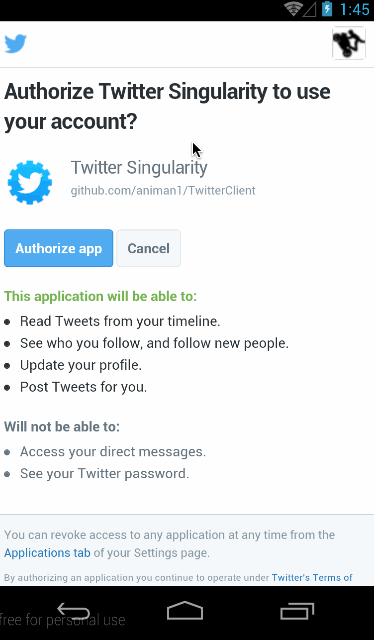

# Project 3 - Twitter Client

Twitter Singularity is an android app that allows a user to view his Twitter timeline and post a new tweet. The app utilizes the [Twitter REST API](https://dev.twitter.com/rest/public).

Time spent: 22 hours spent in total

## User Stories

The following **required** functionality is completed:

* [x] User can **sign in to Twitter** using OAuth login
* [x] User can **view tweets from their home timeline**
  * [x] User is displayed the username, name, and body for each tweet
  * [x] User is displayed the [relative timestamp](https://gist.github.com/nesquena/f786232f5ef72f6e10a7) for each tweet "8m", "7h"
* [x] User can **compose and post a new tweet**
  * [x] User can click a “Compose” icon in the Action Bar on the top right
  * [x] User can then enter a new tweet and post this to twitter
  * [x] User is taken back to home timeline with **new tweet visible** in timeline
* [x] User can switch between Timeline and Mention views using tabs.
  * [x] User can view their home timeline tweets.
  * [x] User can view the recent mentions of their username.
* [x] User can navigate to view their own profile
  * [x] User can see picture, tagline, # of followers, # of following, and tweets on their profile.
* [x] User can click on the profile image in any tweet to see another user's profile.
  * [x] User can see picture, tagline, # of followers, # of following, and tweets of clicked user.
  * [x] Profile view should include that user's timeline
  * [ ] Optional: User can view following / followers list through the profile
* [x] User can infinitely paginate any of these timelines (home, mentions, user) by scrolling to the bottom

The following **optional** features are implemented:

* [x] User can **see a counter with total number of characters left for tweet** on compose tweet page
* [ ] User can **click a link within a tweet body** on tweet details view. The click will launch the web browser with relevant page opened.
* [x] User can **pull down to refresh tweets timeline**
* [x] User can **open the twitter app offline and see last loaded tweets**. Persisted in SQLite tweets are refreshed on every application launch. While "live data" is displayed when app can get it from Twitter API, it is also saved for use in offline mode.
* [ ] User can tap a tweet to **open a detailed tweet view**
  * [ ] User can **select "reply" from detail view to respond to a tweet**
  * [ ] User can take favorite (and unfavorite) or reweet actions on a tweet
* [ ] Improve the user interface and theme the app to feel "twitter branded"
* [ ] When a network request is sent, user sees an indeterminate progress indicator
* [ ] User can search for tweets matching a particular query and see results

The following **bonus** features are implemented:

* [ ] User can see embedded image media within the tweet detail view
* [ ] Compose tweet functionality is build using modal overlay

## Video Walkthrough 

Here's a walkthrough of implemented user stories:

GIF created with [LiceCap](http://www.cockos.com/licecap/).

## Open-source libraries used

- [Android Async HTTP](https://github.com/loopj/android-async-http) - Simple asynchronous HTTP requests with JSON parsing
- [Picasso](http://square.github.io/picasso/) - Image loading and caching library for Android

## License

    Copyright 2015 Daniel Boeve

    Licensed under the Apache License, Version 2.0 (the "License");
    you may not use this file except in compliance with the License.
    You may obtain a copy of the License at

        http://www.apache.org/licenses/LICENSE-2.0

    Unless required by applicable law or agreed to in writing, software
    distributed under the License is distributed on an "AS IS" BASIS,
    WITHOUT WARRANTIES OR CONDITIONS OF ANY KIND, either express or implied.
    See the License for the specific language governing permissions and
    limitations under the License.